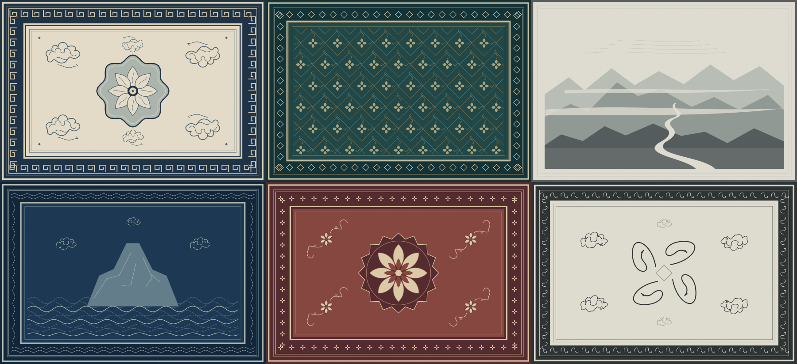

# 一席 · Desktop Mat

A tactile rug for your Mac desktop. 原生 macOS 桌面物件。

把现实中「把杂乱藏到地毯下面」的动作，变成桌面上的一个小玩具。地毯铺在 Finder 图标上方、普通应用窗口下方；抓住中部拉动，抓住边角掀开，松手让它落下。

Desktop Mat places a cloth rug above Finder desktop icons and below ordinary application windows. Pull the fabric, lift a corner, and let gravity bring it back down. It visually covers desktop clutter without changing your files or wallpaper.

**macOS 15+ · Swift 6 · AppKit / SwiftUI · Metal · MIT**



## 当前功能 / Features

- **真实布料网格**：40 × 30 网格单元、1271 个粒子，XPBD 结构、剪切与弯曲约束；重力、摩擦、阻尼和轻微回弹。
- **局部拖动与掀角**：抓取处先受力，周围布料随后跟上。卷折、正反面材质和阴影由变形网格绘制。
- **动态鼠标穿透**：地毯外及当前网格未覆盖的区域穿透；抓取期间由同一地毯持续接收拖动。
- **菜单栏控制**：显隐、重置位置、主题选择，以及紧凑的地毯画廊。
- **多显示器**：每个显示器有独立地毯；主题选择保存在本机。

The app uses a deformable cloth mesh, rather than dragging or rotating a flat image. Rendering and mouse hit testing share the same projected mesh. The app lives in the menu bar and does not appear in the Dock.

### 地毯预设 / Rug presets

| 预设 | Palette and pattern |
| --- | --- |
| 宁夏毯 · 祥云 / Ningxia | 米白、靛青；祥云与回纹 / Ivory and indigo, cloud and border motifs |
| 宋锦 / Song Brocade | 深青、米色、暗金；几何与缠枝 / Deep teal, cream and muted gold, geometric and botanical forms |
| 水墨山河 / Ink Landscape | 灰白；抽象山、水、云雾 / Grayscale, abstract mountains, water and mist |
| 海水江崖 / Sea and Cliffs | 深蓝；克制的海浪、山石与云纹 / Deep blue, restrained waves, rocks and clouds |
| 中国红 / Cinnabar | 低饱和朱砂、暗红与米白 / Muted cinnabar, dark red and ivory |
| 隐藏熊猫 / Hidden Panda | 高级黑白；小型熊猫轮廓藏于纹样 / Black and ivory, small panda silhouettes within the pattern |

预设采用程序化绘制，叠加织物细节。它们是原创现代图形诠释，不代表对历史织物的复原。0.3 的 Release 构建、8 项引擎测试和 19 项本机运行检查通过；画廊切换已用原生 UI 点击验证。所有屏幕使用同一主题，独立屏幕主题与位置记忆仍待开发。

These are original procedural interpretations of textile motifs. Version 0.3 passes a local Release build, 8 engine tests and 19 runtime checks, with native gallery selection verified. The selected theme currently applies to all displays; per-display themes and placement persistence are planned.

切换主题会保留当前布料的形状与位置；重新启动会恢复上次选择的主题。

Changing a theme preserves the current cloth shape and position. Restarting restores your last selected theme.

## 下载 / Download

[v0.3.0 开发预览](https://github.com/myh66/DesktopMat/releases/tag/v0.3.0)提供 macOS 15+ Universal DMG 与 ZIP，包含 Apple Silicon 和 Intel 架构。打开 DMG，将应用拖入 Applications；旧版运行时先从菜单栏退出，再打开新版。应用使用 ad-hoc 开发签名、尚未公证，首次打开与已知限制见下载页。

Download the [v0.3.0 developer preview](https://github.com/myh66/DesktopMat/releases/tag/v0.3.0) for macOS 15+, with arm64 and x86_64 in one Universal package. Drag the app to Applications and quit the old version before launching. This preview is ad-hoc signed and not notarized; see the release notes for first-launch guidance and limitations.

## 构建与运行 / Build and run

需要 macOS 15+ 和包含 Swift 6 的 Xcode 或 Command Line Tools；没有第三方包依赖。

```sh
git clone https://github.com/myh66/DesktopMat.git
cd DesktopMat
bash scripts/build-app.sh release
open "build/一席 · Desktop Mat.app"
```

也可用 Xcode 打开 `Package.swift`。应用启动后，回到桌面拖动地毯；从菜单栏选择主题或打开画廊。需要替换正在运行的开发版时：

```sh
"build/一席 · Desktop Mat.app/Contents/MacOS/DesktopMat" --replace --show
```

Build the app locally with the command above, then use its menu bar item. The build script packages resources and applies an ad-hoc development signature. This is **not a notarized distribution or an App Store build**.

生成通用发行包（需要完整 Xcode）/ Build Universal distribution packages (requires full Xcode):

```sh
bash scripts/package-release.sh
```

DMG、ZIP 与 SHA256SUMS 输出到 `build/releases/v<version>/`。推送与 Info.plist 版本一致的 `v<version>` tag 后，发行工作流测试并构建通用包，上传为草稿；核对资产后在 GitHub 发布。

The tag-driven release workflow tests and builds the Universal packages, then uploads a draft. Inspect the assets before publishing it on GitHub.

## 非破坏性 / Non-destructive by design

地毯只是一层视觉遮挡。当前版本不读取、移动、修改或删除桌面文件，不改变 Finder 文件位置，也不更换壁纸。退出应用后，这层遮挡消失，文件仍在原处。

The current app does not read, move, modify, or delete desktop files. It does not change Finder icon positions or your wallpaper. Quitting removes the visual overlay.

## 验证与限制 / Validation and limitations

纯引擎测试，可在没有交互桌面的环境运行：

```sh
swift test -c release --disable-sandbox
```

本机图形会话集成检查：

```sh
bash scripts/verify-cloth.sh
```

集成脚本验证 WindowServer 层级、原生 responder 抓取所有权、实时布料与 Metal 输出，并将结果保存到 `artifacts/`。CI 只运行引擎测试与应用构建，不运行需要交互图形会话的检查。

验证记录：[0.3 预设与画廊](docs/PRESETS-VERIFICATION.md)、[0.2 布料集成](docs/INTERACTION-VERIFICATION.md)与[引擎验证](docs/CLOTH-ENGINE-VERIFICATION.md)。本进程 responder fixture 不能替代真实 OS 鼠标派发验收；快速首次点击、连续拖动、掀开后 Finder 点选仍需实机验证。

Known limits:

- Actual OS mouse delivery and Finder click-through still require manual acceptance testing.
- No cloth self-collision yet; extreme folds may intersect or retain creases.
- Rugs do not transfer between displays while dragging.
- Scaling, rotation, physics presets and Sweep Mode are planned, not shipped.
- The minimum target is macOS 15; complex Spaces, Stage Manager, full-screen and display hot-plug behavior need broader testing.
- A CPU simulation benchmark does not establish a guaranteed 60 or 120 FPS for the complete app.

## 参与 / Contributing

欢迎布料稳定性、Metal 材质、桌面交互兼容性与原创主题贡献。请先阅读 [CONTRIBUTING.md](CONTRIBUTING.md)。主题只接受原创或明确允许再分发的素材；参考视频不作为仓库素材。

See [architecture](docs/ARCHITECTURE.md), [roadmap](docs/ROADMAP.md), and [feature ideas](docs/FEATURE-IDEAS.md). Contributions are welcome, especially cloth stability, native desktop behavior, materials and original rugs.

## License

[MIT](LICENSE), copyright 2026 Desktop Mat contributors.
